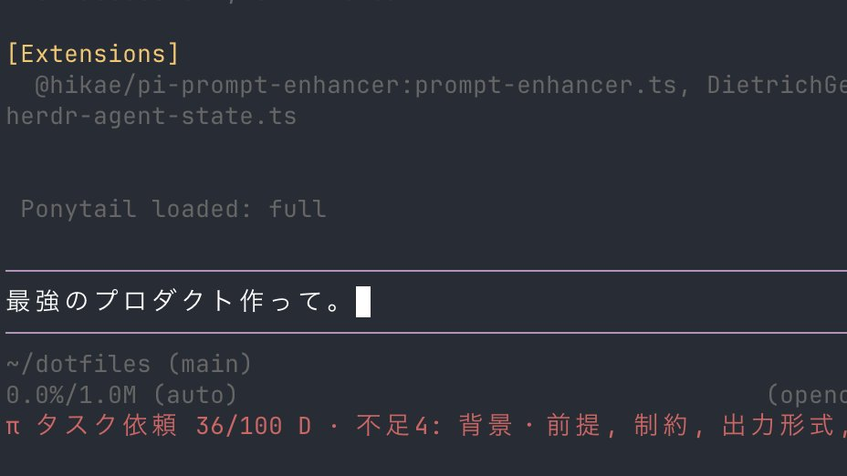

# pi-prompt-enhancer

プロンプトを書いている最中に、足りていない情報をリアルタイム評価するpi拡張。

```
$ いい感じにして
π タスク依頼 20/100 D · 不足5: 目的・ゴール, 背景・前提, 制約, 出力形式, 完了条件
```

```
$ CSV のエクスポート処理が読みにくいので直したい。背景は先週の条件分岐が増えたこと。
制約は外部依存を増やさないこと。出力は差分のみ。既存テストが通ることを確認条件にする。
π タスク依頼 100/100 A · 不足なし
```



## こんな時に便利

モデルに不足点を渡すので曖昧なままタスクを開始しないガードになります。
評価はエージェントにも同じ内容が渡るので、足りない情報を推測で埋めず、質問するか、置いた仮定を明示するように振る舞います。

## インストール

```sh
pi install npm:@hikae/pi-prompt-enhancer
```

## セットアップ

[TypeSafe の dashboard](https://console.typesafe.ai/keys) で API キーを発行して、環境変数に入れる。

```sh
export TYPESAFE_API_KEY=...
```

| 環境変数 | 既定値 | 説明 |
| --- | --- | --- |
| `TYPESAFE_API_KEY` | （なし） | 必須 |
| `TYPESAFE_MODEL` | `jev-latest` | 使う jev のモデル / エイリアス |

## 参考資料

Claude の [prompting best practices](https://platform.claude.com/docs/en/build-with-claude/prompt-engineering/claude-prompting-best-practices) をもとに評価。

| 種類 | 見ている項目 |
| --- | --- |
| 質問 | 目的・ゴール / 背景・前提 / 試したこと / 用途 |
| タスク依頼 | 目的・ゴール / 背景・前提 / 制約 / 出力形式 / 完了条件 |
| 分析 | 目的・ゴール / 背景・前提 / 対象データ / 評価軸 / 出力形式 |
| 創作 | 目的・ゴール / 背景・前提 / 読み手 / トーン・文体 / 例 |
| 雑談 | （なし） |

スコアは 100 から、**確度高く不足している項目1件につき減点**する方式。判定が割れている項目は減点対象から外すので、書きかけでも不当に低い点にはなりません。A / B / C / D の4段階で表示する。

## footer の読み方

| 表示 | 意味 |
| --- | --- |
| `π タスク依頼 0/100 D · 不足5: 目的・ゴール, ...` | 評価できた。右に並ぶのが足りていない項目 |
| `π タスク依頼 100/100 A · 不足なし` | 追加すべきものは無い |
| `π TYPESAFE_API_KEY 未設定` | キーが環境に入っていない |
| `π jev 失敗: ...` | 呼び出しに失敗した。プロンプトは素通りする |

## ライセンス

MIT
